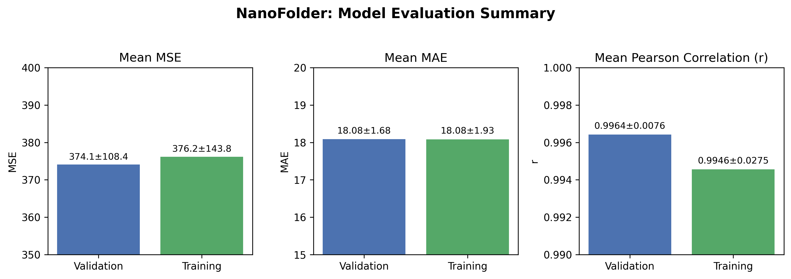

# 🧬 NanoFolder

**Interactive Protein Distance Predictor Powered by AI**

[](https://www.python.org/)
[](LICENSE)
[](https://streamlit.io/)

NanoFolder is a Streamlit-based app that predicts **distance maps** — and reconstructs rough 3D protein structures — from amino acid sequences using deep learning, and is optimized for single-domain antibodies (sdAb).  
Inspired by AlphaFold, this project explores the core ideas behind protein folding using modern tools like **ESM2** and **transformers**.

---

## 📽️ Demo

<p align="center">
  
</p>

---

## ⚠️ Disclaimer

This app is a **simplified educational project**, not a research-grade tool.  
It omits many biological and physical constraints present in real protein folding models like AlphaFold.  
Use it to understand how these systems work, not for scientific or medical conclusions.

---

## 🔍 What It Does

1. **Input:** Amino acid sequence (optimized for single-domain antibodies, sdAbs)
2. **Embeddings:** Generated using Meta's **ESM2** protein language model
3. **Prediction:** A transformer-based model predicts a pairwise **distance map**
4. **Reconstruction:** Simplified backbone structure generated from the predicted map using multidimensional scaling 
5. **Visualization:** Both distance heatmap and 3D structure are displayed interactively

---

## 🧪 Why sdAbs?

- Small: they typically consist of ~110–130 residues, making them ideal for fast inference and easy visualization (e.g.[Muyldermans, 2013](#references))
- Medically relevant: sdAbs are used in therapeutics and diagnostics, including applications in oncology, virology, and neurodegenerative diseases (e.g. [Van Audenhove & Gettemans, 2016](#references))
- Well-characterized: hundreds of sdAb structures are available in public databases like SAbDab (e.g. [Dunbar et al., 2014](#references))

---

## 📁 Project Structure

```text
NanoFolder_app/
├── LICENSE                       # MIT license for open-source reuse
├── README.md                     # Project documentation
├── images
│   ├── background.png            # Custom background image for app styling
│   ├── demo.gif                  # GIF demo showing app usage
│   └── performance_summary.png   # Plot of the evaulated model performance
├── model                         # Folder containing trained PyTorch model weights
│   ├── trained_model_fold0.pt
│   ├── trained_model_fold1.pt
│   ├── trained_model_fold2.pt
│   ├── trained_model_fold3.pt
│   └── trained_model_fold4.pt
├── requirements.txt              # Python dependencies for running the app
└── src
    ├── app.py                    # Main Streamlit app – handles UI and model inference
    ├── pdb_converter.py          # Reconstructs 3D structures from predicted distance maps
    └── transformer_predictor.py  # Transformer-based neural network architecture for prediction                   
```

---

## 📊 Model Performance

To assess NanoFolder's predictive accuracy, we evaluated the ensemble on a held-out subset comprising over 20% of the training and validation data. The results are summarized below:



---

## 🙏 Acknowledgements

- [Meta AI](https://github.com/facebookresearch/esm) for the **ESM2** protein language model  
- [DeepMind](https://www.deepmind.com/research/highlighted-research/alphafold) for the inspiration via **AlphaFold**  
- [Streamlit](https://streamlit.io/) for enabling fast, beautiful scientific UIs

---

## 📚 References

- Muyldermans, Serge. “Nanobodies: natural single-domain antibodies.” *Annual review of biochemistry* vol. 82 (2013): 775-97.   
  [doi: 10.1146/annurev-biochem-063011-092449](https://doi.org/10.1146/annurev-biochem-063011-092449)

- Van Audenhove, Isabel, and Jan Gettemans. “Nanobodies as Versatile Tools to Understand, Diagnose, Visualize and Treat Cancer.” *EBioMedicine* vol. 8 (2016): 40-48.
  [doi: 10.1016/j.ebiom.2016.04.028](https://doi.org/10.1016/j.ebiom.2016.04.028)

- Dunbar, James et al. “SAbDab: the structural antibody database.” *Nucleic acids research* vol. 42,Database issue (2014)  
  [doi: 10.1093/nar/gkt1043](https://doi.org/10.1093/nar/gkt1043)

